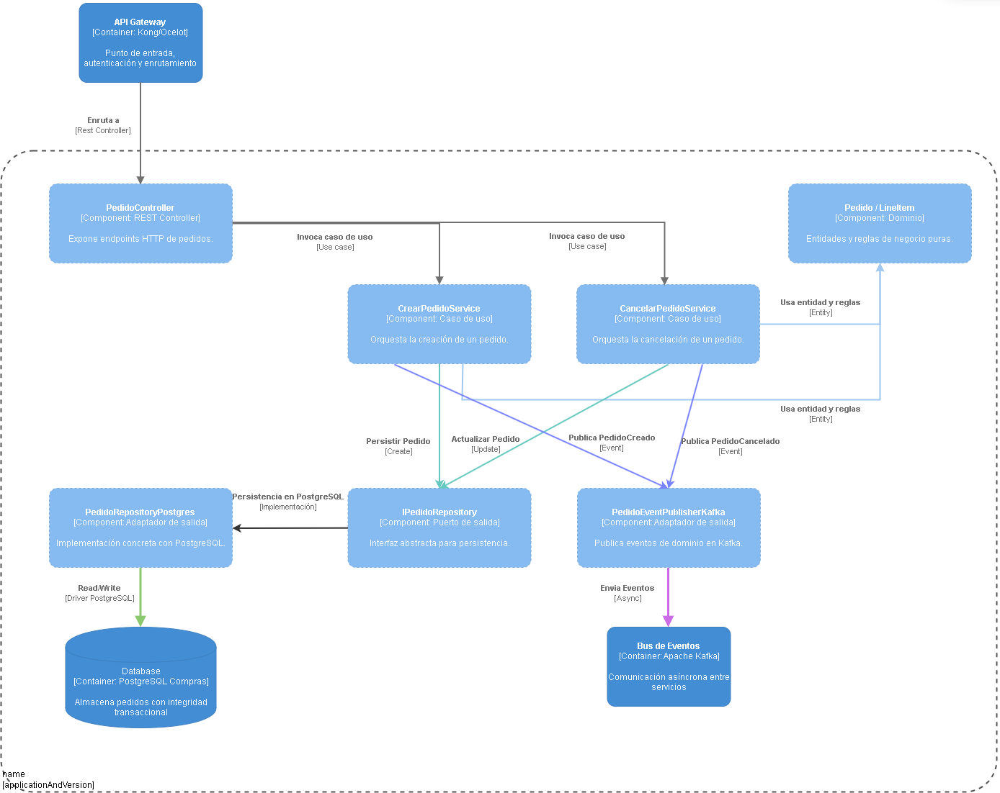
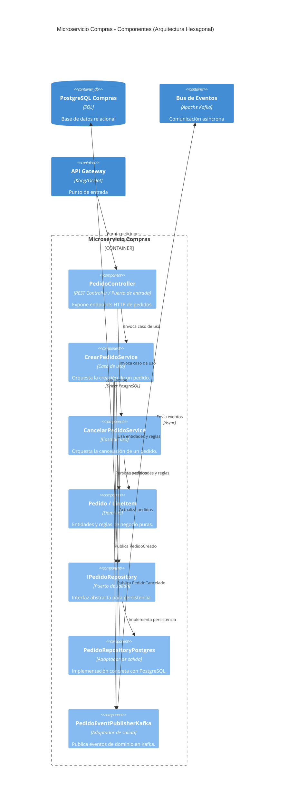

# Diagrama C4 - Componentes (Microservicio Compras/Órdenes)

Este diagrama muestra la estructura interna del microservicio de Compras (Órdenes), uno de los componentes críticos del sistema E-Market Multiplataforma. Se utiliza arquitectura hexagonal (puertos y adaptadores) para aislar la lógica de negocio de las dependencias externas, facilitando la mantenibilidad y la evolución del sistema.

Codigo del diagrama visualizado en la imagen

 

**Explicación:**
- **PedidoController (Puerto de entrada):** Recibe las solicitudes HTTP desde el API Gateway y las traduce a comandos de aplicación.
- **CrearPedidoService / CancelarPedidoService (Casos de uso):** Orquestan la lógica de negocio, validando reglas y coordinando la persistencia y publicación de eventos.
- **Pedido / LineItem (Dominio):** Contienen las entidades y lógica pura del dominio (CalcularTotal, AgregarItem, Cancelar). No dependen de infraestructura.
- **IPedidoRepository (Puerto de salida):** Define la interfaz abstracta para almacenar y recuperar pedidos. Permite cambiar la implementación sin afectar el dominio.
- **PedidoRepositoryPostgres (Adaptador de salida):** Implementa la persistencia usando PostgreSQL con integridad transaccional.
- **PedidoEventPublisherKafka (Adaptador de salida):** Publica eventos de dominio (PedidoCreado, PedidoCancelado) en el bus de eventos Kafka para que otros servicios reaccionen.

Este diseño permite desacoplar la lógica de negocio de la infraestructura, facilitando pruebas, cambios tecnológicos y escalabilidad. Los nombres de los componentes corresponden directamente a los archivos en `/src/Compras/`.
