# Diagrama C4 - Contenedores

Este diagrama describe la estructura principal de despliegue del sistema E-Market Multiplataforma, mostrando los contenedores (aplicaciones, servicios, bases de datos) y sus tecnologías clave.

```mermaid
C4Container
    title E-Market Multiplataforma - Contenedores
    
    Person(cliente, "Cliente", "Usuario final del sistema")
    Person(proveedor, "Proveedor Externo", "Gestiona catálogo y ventas")
    Person(admin, "Administrador / Marketing", "Supervisa, gestiona campañas y reportes")

    System_Boundary(system, "E-Market Multiplataforma") {
      Container(web, "Web App", "React/Next.js", "Interfaz web para clientes y proveedores")
      Container(mobile, "Mobile App", "React Native", "App móvil para clientes")
      Container(api, "API Gateway", "Kong/Ocelot", "Punto de entrada, autenticación y enrutamiento")

      Container(cat, "Microservicio Catálogo", "Node.js", "Gestión de productos, búsquedas y categorías")
      Container(usr, "Microservicio Usuarios", "Node.js", "Gestión de usuarios, roles y permisos")
      Container(ord, "Microservicio Compras", "Node.js", "Gestión de pedidos y carrito")
      Container(pay, "Microservicio Pagos", "Node.js", "Procesamiento de pagos y reembolsos")
      Container(log, "Microservicio Logística", "Node.js", "Gestión de envíos y seguimiento")
      Container(int, "Microservicio Integraciones", "Node.js", "Sincronización con proveedores y transportistas")
      Container(rep, "Microservicio Reportes", "Node.js", "Generación de reportes de ventas y estadísticas")
      
      Container(kafka, "Bus de Eventos", "Apache Kafka", "Comunicación asíncrona entre servicios")

      ContainerDb(mongo, "MongoDB", "NoSQL", "Almacena catálogo de productos (flexible, escalable)")
      ContainerDb(pgord, "PostgreSQL Compras", "SQL", "Almacena pedidos con integridad transaccional")
      ContainerDb(pgpay, "PostgreSQL Pagos", "SQL", "Almacena transacciones de pago")
      ContainerDb(pgusr, "PostgreSQL Usuarios", "SQL", "Almacena usuarios, roles y permisos")
    }

    System_Ext(extpagos, "Pasarela de Pagos", "Stripe, PayPal")
    System_Ext(extlog, "Servicio de Logística", "Transportistas externos")
    System_Ext(extnotif, "Servicio de Notificaciones", "Email/SMS Gateway")

    Rel(cliente, web, "Usa", "HTTPS")
    Rel(cliente, mobile, "Usa", "HTTPS")
    Rel(proveedor, web, "Gestiona catálogo", "HTTPS")
    Rel(admin, web, "Administra y consulta reportes", "HTTPS")
    Rel(web, api, "Llamadas API", "JSON/HTTPS")
    Rel(mobile, api, "Llamadas API", "JSON/HTTPS")

    Rel(api, cat, "Enruta a", "REST")
    Rel(api, usr, "Enruta a", "REST")
    Rel(api, ord, "Enruta a", "REST")
    Rel(api, pay, "Enruta a", "REST")
    Rel(api, log, "Enruta a", "REST")
    Rel(api, int, "Enruta a", "REST")
    Rel(api, rep, "Enruta a", "REST")

    Rel(cat, mongo, "Lee/Escribe", "Driver MongoDB")
    Rel(ord, pgord, "Lee/Escribe", "Driver PostgreSQL")
    Rel(pay, pgpay, "Lee/Escribe", "Driver PostgreSQL")
    Rel(usr, pgusr, "Lee/Escribe", "Driver PostgreSQL")

    Rel(cat, kafka, "Publica eventos", "Async")
    Rel(ord, kafka, "Publica/consume", "Async")
    Rel(pay, kafka, "Publica/consume", "Async")
    Rel(log, kafka, "Publica/consume", "Async")
    Rel(int, kafka, "Publica/consume", "Async")
    Rel(rep, kafka, "Consume eventos", "Async")
    Rel(usr, kafka, "Publica eventos", "Async")

    Rel(pay, extpagos, "Procesa pagos", "HTTPS/API")
    Rel(log, extlog, "Consulta envíos", "HTTPS/API")
    Rel(int, extnotif, "Envía notificaciones", "SMTP/API")
```

**Explicación:**
- **Web App y Mobile App:** Proveen la interfaz de usuario para clientes, proveedores y administradores, permitiendo navegación, compras, gestión de catálogo y seguimiento de pedidos.
- **API Gateway:** Centraliza la autenticación, el enrutamiento y la seguridad de las peticiones hacia los microservicios.
- **Microservicios:** Cada uno gestiona un dominio específico, permitiendo escalabilidad y despliegue independiente:
  - **Catálogo:** Productos, búsquedas y categorías.
  - **Usuarios:** Registro, autenticación, roles y permisos.
  - **Compras:** Carrito, pedidos y ciclo de vida de la orden.
  - **Pagos:** Procesamiento de pagos y reembolsos via pasarelas externas.
  - **Logística:** Envíos, seguimiento e integración con transportistas.
  - **Integraciones:** Sincronización con proveedores externos y servicios de notificaciones.
  - **Reportes:** Generación de reportes de ventas y estadísticas para marketing y finanzas.
- **Bus de Eventos (Kafka):** Facilita la comunicación asíncrona y desacoplada entre microservicios, soportando eventos de negocio en tiempo real.
- **Bases de Datos (Persistencia Políglota - ADR-004):**
  - **MongoDB** para el catálogo: flexible y escalable para atributos variables de productos.
  - **PostgreSQL** para compras, pagos y usuarios: integridad transaccional y consultas complejas.

Esta estructura permite escalar y mantener cada parte del sistema de forma autónoma, facilitando la evolución y la resiliencia ante fallos.
