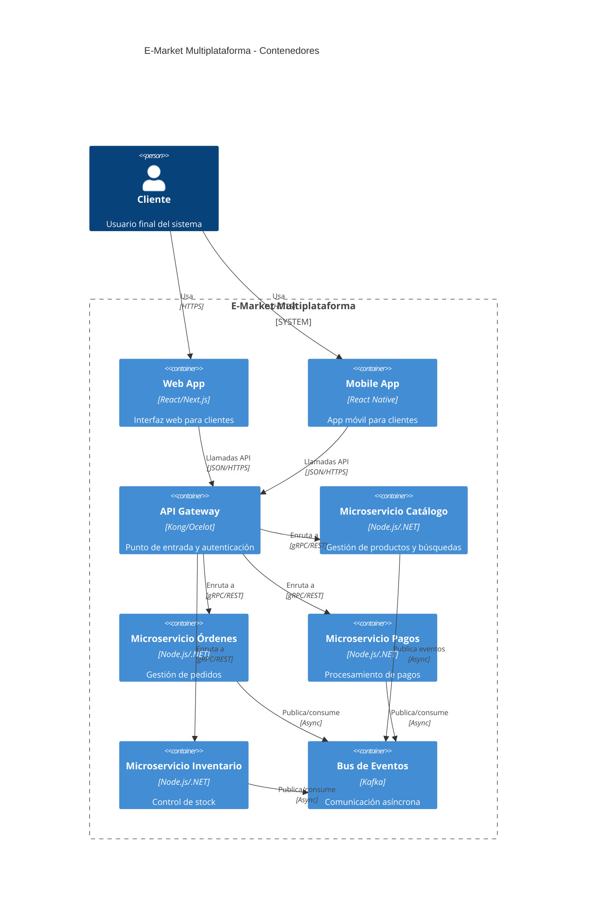

# Diagrama C4 - Contenedores

Este diagrama describe la estructura principal de despliegue del sistema E-Market Multiplataforma, mostrando los contenedores (aplicaciones y servicios) y sus tecnologías clave.

**Explicación:**
- **Web App y Mobile App:** Proveen la interfaz de usuario para clientes, permitiendo navegación, compras y seguimiento de pedidos.
- **API Gateway:** Centraliza la autenticación, el enrutamiento y la seguridad de las peticiones hacia los microservicios.
- **Microservicios:** Cada uno gestiona un dominio específico (catálogo, órdenes, pagos, inventario), permitiendo escalabilidad y despliegue independiente.
- **Bus de Eventos (Kafka):** Facilita la comunicación asíncrona y desacoplada entre microservicios, soportando eventos de negocio en tiempo real.

Esta estructura permite escalar y mantener cada parte del sistema de forma autónoma, facilitando la evolución y la resiliencia ante fallos.
