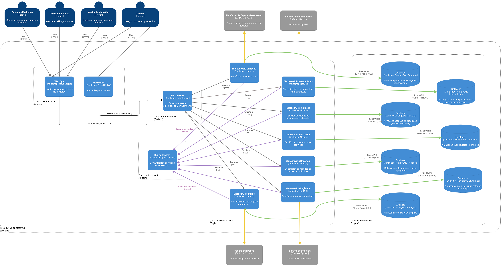

# Diagrama C4 - Contenedores

Este diagrama describe la estructura principal de despliegue del sistema E-Market Multiplataforma, mostrando los contenedores (aplicaciones, servicios, bases de datos) y sus tecnologías clave. Se organizaron los contenedores en capas lógicas para mayor claridad.

```mermaid
C4Container
    title E-Market Multiplataforma - Contenedores
    
    Person(cliente, "Cliente", "Usuario final del sistema")
    Person(proveedor, "Proveedor Externo", "Gestiona catálogo y ventas")
    Person(admin, "Administrador", "Supervisa usuarios, disputas y operación")
    Person(marketing, "Gestor de Marketing", "Gestiona campañas, cupones y consulta reportes")

    System_Boundary(system, "E-Market Multiplataforma") {
      
      System_Boundary(front, "Capa de Presentación") {
        Container(web, "Web App", "React/Next.js", "Interfaz web para clientes y proveedores")
        Container(mobile, "Mobile App", "React Native", "App móvil para clientes")
      }
      
      System_Boundary(gateway, "Capa de Enrutamiento") {
        Container(api, "API Gateway", "Kong", "Punto de entrada, autenticación y enrutamiento")
      }
      
      System_Boundary(services, "Capa de Microservicios") {
        Container(cat, "Microservicio Catálogo", "Node.js", "Gestión de productos, búsquedas y categorías")
        Container(usr, "Microservicio Usuarios", "Node.js", "Gestión de usuarios, roles y permisos")
        Container(ord, "Microservicio Compras", "Node.js", "Gestión de pedidos y carrito")
        Container(pay, "Microservicio Pagos", "Node.js", "Procesamiento de pagos y reembolsos")
        Container(log, "Microservicio Logística", "Node.js", "Gestión de envíos y seguimiento")
        Container(int, "Microservicio Integraciones", "Node.js", "Sincronización con proveedores y transportistas")
        Container(rep, "Microservicio Reportes", "Node.js", "Generación de reportes de ventas y estadísticas")
      }
      
      System_Boundary(messaging, "Capa de Mensajería") {
        Container(kafka, "Bus de Eventos", "Apache Kafka", "Comunicación asíncrona entre servicios")
      }
      
      System_Boundary(data, "Capa de Persistencia") {
        ContainerDb(mongo, "MongoDB", "NoSQL", "Almacena catálogo de productos (flexible, escalable)")
        ContainerDb(pgord, "PostgreSQL Compras", "SQL", "Almacena pedidos con integridad transaccional")
        ContainerDb(pgpay, "PostgreSQL Pagos", "SQL", "Almacena transacciones de pago")
        ContainerDb(pgusr, "PostgreSQL Usuarios", "SQL", "Almacena usuarios, roles y permisos")
        ContainerDb(pglog, "PostgreSQL Logística", "SQL", "Almacena envíos, tracking y estados de entrega")
        ContainerDb(pgint, "PostgreSQL Integraciones", "SQL", "Configuraciones de proveedores y logs de sincronización")
        ContainerDb(pgrep, "PostgreSQL Reportes", "SQL", "Definiciones de reportes y datos agregados")
      }
    }

    System_Ext(extpagos, "Pasarela de Pagos", "Stripe, PayPal")
    System_Ext(extlog, "Servicio de Logística", "Transportistas externos")
    System_Ext(extnotif, "Servicio de Notificaciones", "Email/SMS Gateway")
    System_Ext(extcupones, "Plataforma de Cupones/Descuentos", "Provee cupones y promociones de terceros")

    Rel(cliente, web, "Usa", "HTTPS")
    Rel(cliente, mobile, "Usa", "HTTPS")
    Rel(proveedor, web, "Gestiona catálogo", "HTTPS")
    Rel(admin, web, "Administra plataforma", "HTTPS")
    Rel(marketing, web, "Gestiona campañas y reportes", "HTTPS")
    Rel(web, api, "Llamadas API", "JSON/HTTPS")
    Rel(mobile, api, "Llamadas API", "JSON/HTTPS")

    Rel(api, cat, "Enruta a", "REST")
    Rel(api, usr, "Enruta a", "REST")
    Rel(api, ord, "Enruta a", "REST")
    Rel(api, pay, "Enruta a", "REST")
    Rel(api, log, "Enruta a", "REST")
    Rel(api, int, "Enruta a", "REST")
    Rel(api, rep, "Enruta a", "REST")

    Rel(cat, mongo, "Lee/Escribe", "Driver MongoDB")
    Rel(ord, pgord, "Lee/Escribe", "Driver PostgreSQL")
    Rel(pay, pgpay, "Lee/Escribe", "Driver PostgreSQL")
    Rel(usr, pgusr, "Lee/Escribe", "Driver PostgreSQL")
    Rel(log, pglog, "Lee/Escribe", "Driver PostgreSQL")
    Rel(int, pgint, "Lee/Escribe", "Driver PostgreSQL")
    Rel(rep, pgrep, "Lee/Escribe", "Driver PostgreSQL")

    Rel(cat, kafka, "Publica eventos", "Async")
    Rel(ord, kafka, "Publica/consume", "Async")
    Rel(pay, kafka, "Publica/consume", "Async")
    Rel(log, kafka, "Publica/consume", "Async")
    Rel(int, kafka, "Publica/consume", "Async")
    Rel(rep, kafka, "Consume eventos", "Async")
    Rel(usr, kafka, "Publica eventos", "Async")

    Rel(pay, extpagos, "Procesa pagos", "HTTPS/API")
    Rel(log, extlog, "Consulta envíos", "HTTPS/API")
    Rel(int, extnotif, "Envía notificaciones", "SMTP/API")
    Rel(ord, extcupones, "Valida y aplica cupones", "HTTPS/API")
```

Codigo del diagrama visualizado en la imagen

 

**Estructura de capas:**

| Capa | Contenedores | Descripción |
|------|--------------|-------------|
| **Presentación** | Web App, Mobile App | Interfaces de usuario que consumen la API |
| **Enrutamiento** | API Gateway | Punto único de entrada, auth, rate limiting |
| **Microservicios** | Catálogo, Usuarios, Compras, Pagos, Logística, Integraciones, Reportes | Lógica de negocio dividida por dominio |
| **Mensajería** | Kafka | Comunicación asíncrona y desacoplada |
| **Persistencia** | MongoDB, PostgreSQL (x6) | Almacenamiento políglota según necesidad de cada dominio |

Esta organización visual facilita entender cómo fluyen las peticiones: Frontend → Gateway → Microservicio → DB/Kafka, manteniendo cada capa independiente y escalable.

**Nota sobre el patrón de comunicación:**

El diagrama utiliza un **patrón híbrido** estándar en arquitecturas de microservicios:

| Flujo | Tecnología | Razonamiento |
|-------|------------|--------------|
| **Cliente → API Gateway → Microservicios** | REST síncrono | El usuario espera una respuesta inmediata (login, ver catálogo, crear pedido). REST proporciona latencia baja y manejo simple de errores HTTP. |
| **Microservicio ↔ Microservicio** | Kafka asíncrono | Los eventos de negocio ("PedidoCreado", "PagoProcesado", "StockActualizado") se publican en el bus para que otros servicios reaccionen sin acoplamiento temporal. Esto garantiza resiliencia: si el servicio de Logística está caído, el evento queda en Kafka hasta que vuelva. |

Esta separación combina la **simplicidad y velocidad de REST** para interacciones cliente-servidor con la **resiliencia y desacoplamiento de EDA** para procesos internos del sistema.

**Explicación:**
- **Web App y Mobile App:** Proveen la interfaz de usuario para clientes, proveedores y administradores, permitiendo navegación, compras, gestión de catálogo y seguimiento de pedidos.
- **API Gateway:** Centraliza la autenticación, el enrutamiento y la seguridad de las peticiones hacia los microservicios.
- **Microservicios:** Cada uno gestiona un dominio específico, permitiendo escalabilidad y despliegue independiente:
  - **Catálogo:** Productos, búsquedas y categorías.
  - **Usuarios:** Registro, autenticación, roles y permisos.
  - **Compras:** Carrito, pedidos y ciclo de vida de la orden.
  - **Pagos:** Procesamiento de pagos y reembolsos via pasarelas externas.
  - **Logística:** Envíos, seguimiento e integración con transportistas.
  - **Integraciones:** Sincronización con proveedores externos y servicios de notificaciones.
  - **Reportes:** Generación de reportes de ventas y estadísticas para marketing y finanzas.
- **Bus de Eventos (Kafka):** Facilita la comunicación asíncrona y desacoplada entre microservicios, soportando eventos de negocio en tiempo real.
- **Bases de Datos (Persistencia Políglota - ADR-004):**
  - **MongoDB** para el catálogo: flexible y escalable para atributos variables de productos.
  - **PostgreSQL** para compras, pagos, usuarios, logística, integraciones y reportes: integridad transaccional y consultas complejas. Cada microservicio tiene su propia instancia aislada.

Esta estructura permite escalar y mantener cada parte del sistema de forma autónoma, facilitando la evolución y la resiliencia ante fallos.
