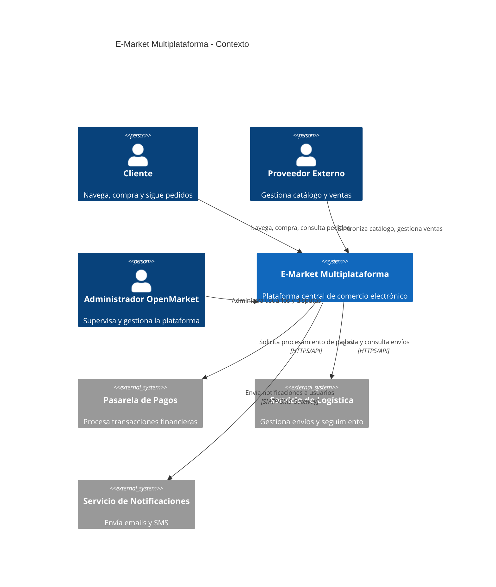

# Diagrama C4 - Contexto

Este diagrama muestra la visión global del sistema E-Market Multiplataforma, sus principales actores y sistemas externos involucrados.

**Explicación:**
- **Cliente:** Usuario final que navega, compra y realiza seguimiento de pedidos.
- **Proveedor Externo:** Empresas que cargan y actualizan su inventario, gestionan ventas y reciben notificaciones.
- **Administrador:** Personal de OpenMarket que gestiona usuarios, resuelve disputas y supervisa la operación.
- **Pasarela de Pagos:** Sistema externo (ej. Stripe, PayPal) encargado de procesar pagos de manera segura.
- **Servicio de Logística:** Integración con transportistas para gestionar envíos y seguimiento de pedidos.
- **Servicio de Notificaciones:** Plataforma para el envío de emails y mensajes a clientes y proveedores.

Este contexto define los límites del sistema y las principales interacciones con el entorno, sirviendo de base para el diseño detallado de la arquitectura.
