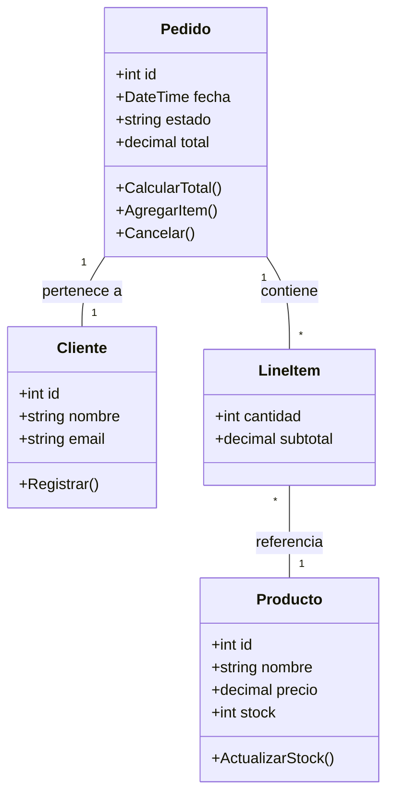
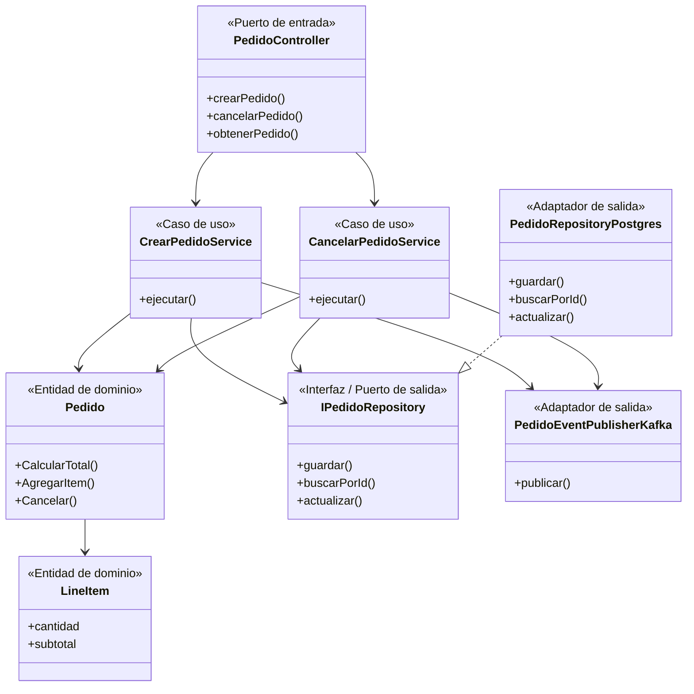

# Diagrama de Clases - Componentes Críticos

Se seleccionan los componentes del microservicio de **Compras** y del microservicio de **Pagos** por su centralidad en el dominio y su relevancia para el cálculo de métricas de distancia desde la secuencia principal.

## Diagrama de clases — Dominio de Compras

## Diagrama de componentes — Microservicio Compras

Este diagrama muestra las dependencias entre los componentes internos del microservicio, organizados según la arquitectura hexagonal. Es la base para el cálculo de métricas del punto 6.

**Explicación:**
- Solo se incluyen atributos y métodos esenciales para el análisis arquitectónico y de métricas.
- El diagrama de dominio muestra las entidades y sus relaciones (Pedido, LineItem, Cliente, Producto).
- El diagrama de componentes muestra las dependencias entre capas hexagonales: los controladores dependen de los servicios de aplicación, estos dependen del dominio y de los puertos de salida, y los adaptadores implementan las interfaces.
- Las flechas representan dependencias que se usan para calcular Ca (acoplamiento aferente) y Ce (acoplamiento eferente) en el punto 6.
- Se priorizó el análisis a nivel de componentes sobre clases individuales, como recomienda la actividad.

**Justificación de la elección:**
El dominio de Compras/Pedidos es crítico porque orquesta la relación entre clientes, productos y pagos, y es el punto central para la trazabilidad y el análisis de calidad estructural del sistema. Además, permite observar claramente la separación hexagonal y calcular métricas significativas.
