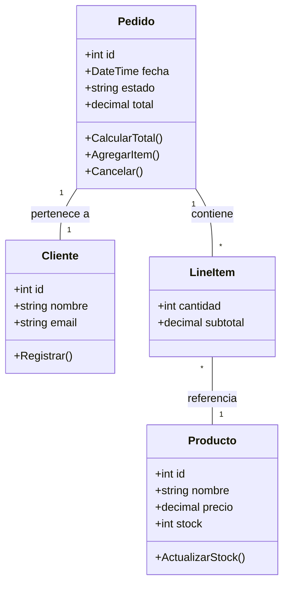

# Diagrama de Clases - Componente Crítico: Pedidos

Se selecciona el componente "Pedidos" por su centralidad en el dominio y su relevancia para el cálculo de métricas de distancia desde la secuencia principal.

**Explicación:**
- Solo se incluyen atributos y métodos esenciales para el análisis arquitectónico y de métricas.
- El método `CalcularTotal()` permite analizar la lógica de negocio y dependencias.
- `AgregarItem()` y `Cancelar()` reflejan operaciones clave del ciclo de vida del pedido.
- El modelo permite calcular métricas de abstracción, inestabilidad y distancia desde la secuencia principal a nivel de componente.
- Se recomienda priorizar el análisis sobre el componente completo (Pedidos) y no sobre clases individuales.

**Justificación de la elección:**
El dominio de Pedidos es crítico porque orquesta la relación entre clientes, productos y pagos, y es el punto central para la trazabilidad y el análisis de calidad estructural del sistema.
